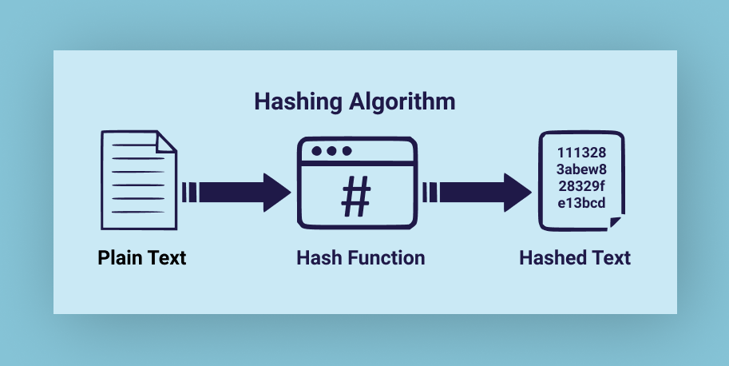
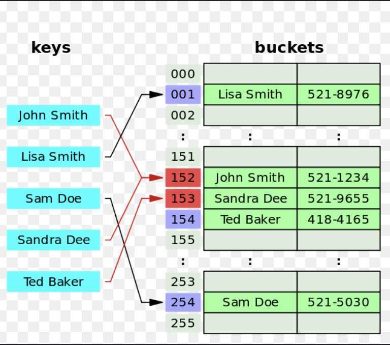

# 해시

- 값이 저장되는 위치를 어떤 규칙으로 정할 수 있다면 데이터를 바로 찾을 수 있다.

- 해시함수를 사용하여 변환한 값을 인덱스로 삼아 키와 값을 저장해서 만든 자료구조

```text
- 해시는 단방향. SEARCH : O(1)
```



## 해시 테이블

- 키와 대응한 값이 저장되어 있는 공간
- 해시 테이블의 각데이터를 버킷



## 해시의 특성을 활용하는 분야

- 비밀번호 관리
- 데이터 베이스 인덱싱
- 블록체인

## 브라우저 환경에서 해시 알고리즘 사용해보기 예시

```js
async function generateHash(message) {
  const msgBuffer = new TextEncoder().encode(message);
  const hashBuffer = await crypto.subtle.digest('SHA-256', msgBuffer);
  const hashArray = Array.from(new Uint8Array(hashBuffer));
  const hashHex = hashArray.map((b) => b.toString(16).padStart(2, '0')).join('');
  return hashHex;
}

generateHash('Hello, World!').then(console.log); // 해시값 출력
```

## 해시알고리즘의 종류와 비교

- MD5
  빠른 속도를 제공하지만, 보안이 취약해 현재는 비밀번호 해싱 등 보안이 중요한 용도에는 권장되지 않음

- SHA-1
  MD5보다 더 나은 보안을 제공하지만, 현재는 충돌 가능성으로 인해 주요 보안 목적으로는 사용되지 않음.

- SHA-256
  SHA-2 계열의 알고리즘 중 하나로, 현재 가장 많이 사용되는 해시 알고리즘. 높은 보안을 제공하며 다양한 보안 프로토콜에서 표준으로 사용.

## 해싱 충돌(Hash Collision)

- 해시 함수는 제한된 크기의 출력값을 생성하기 때문에, 무한한 입력값을 처리하는 과정에서 서로 다른 두 개 이상의 입력값이 동일한 해시값을 가질 수밖에 없다. 이과정에서 동일한 해시값을 가지는것을 해싱 충돌이라 함.

```js
const crypto = require('crypto');

function generateHash(input) {
  return crypto.createHash('sha256').update(input).digest('hex');
}

const inputs = ['input1', 'input2', 'input3'];

const hashMap = new Map();

inputs.forEach((input) => {
  const hash = generateHash(input);
  if (hashMap.has(hash)) {
    console.log(`Collision detected for input: ${input}`);
  } else {
    hashMap.set(hash, input);
  }
});
```

## 해싱 충돌 해결하기

오픈 어드레싱(Open Addressing)이나 체이닝(Chaining) 기법을 사용.

- 체이닝은 해시 테이블의 각 버킷이 단순히 하나의 값만 저장하는 것이 아니라, 리스트(일반적으로 연결 리스트)를 사용하여 동일한 해시값을 가진 여러 요소들을 저장하는 방법

  - 충돌이 발생해도 항상 데이터를 저장할 수 있으며, 해시 테이블이 꽉 차는 경우가 없다.
  - 해시 테이블 크기에 크게 영향을 받지 않으므로, 더 작은 테이블 크기에서도 사용할 수 있다.
  - 최악의 경우, 모든 요소가 하나의 버킷에 저장되면 리스트의 길이가 길어져 검색 속도가 선형적으로 증가할 수 있다.

```js
class HashTable {
  constructor(size = 50) {
    this.table = new Array(size);
  }

  _hash(key) {
    return key.toString().length % this.table.length;
  }

  set(key, value) {
    const index = this._hash(key);
    if (!this.table[index]) {
      this.table[index] = [];
    }
    this.table[index].push([key, value]);
  }

  get(key) {
    const index = this._hash(key);
    if (!this.table[index]) return undefined;
    for (let pair of this.table[index]) {
      if (pair[0] === key) {
        return pair[1];
      }
    }
    return undefined;
  }
}

const hashTable = new HashTable();
```

- 오픈 어드레싱은 충돌이 발생하면 해시 테이블의 다른 빈 공간을 찾아 데이터를 저장하는 방식. 이 방식은 각 버킷에 오직 하나의 요소만 저장되며, 충돌이 발생할 때마다 새로운 위치를 찾음.

- 선형탐사
  - 충돌이 발생할 경우 다음 버킷을 확인, 만약 그 버킷도 사용 중이라면 또 다음 버킷을 확인하는 식으로 빈 버킷을 찾을때까지 이동.
- 이차탐사
  - 충돌이 발생하면 i의 제곱을 더해 다음 위치를 결정
- 이중해싱
  - 충돌이 발생하면 두 번째 해시 함수를 사용하여 새로운 위치를 찾음.

```js
function linearProbing(hash, i, size) {
  return (hash + i) % size;
}

function quadraticProbing(hash, i, size) {
  return (hash + i * i) % size;
}

function doubleHashing(hash1, hash2, i, size) {
  return (hash1 + i * hash2) % size;
}
```

```js
class HashTable {
  constructor(size = 50) {
    this.table = new Array(size);
  }

  _hash(key) {
    return key.toString().length % this.table.length;
  }

  set(key, value) {
    let index = this._hash(key);

    while (this.table[index]) {
      index = (index + 1) % this.table.length; // 선형 탐사
    }
    this.table[index] = [key, value];
  }

  get(key) {
    let index = this._hash(key);
    while (this.table[index]) {
      if (this.table[index][0] === key) {
        return this.table[index][1];
      }
      index = (index + 1) % this.table.length;
    }
    return undefined;
  }
}

const hashTable = new HashTable();
```

- 추가적인 메모리 공간이 필요하지 않음.
- 충돌이 발생해도 해시 테이블 내부에서 해결
- 해시 테이블이 가득 차거나 가까워질수록 성능이 급격히 저하될 수 있음.
- 탐사 과정에서 클러스터링(Clustering) 현상이 발생할 수 있으며, 이는 테이블의 효율을 하락시킴.

- 메모리가 제한적이고 테이블이 빈번하게 가득 차지 않는 경우 오픈 어드레싱이 유리할 수 있지만, 대량의 데이터를 다루거나 충돌이 빈번히 발생할 수 있는 경우에는 체이닝이 더 적합

## hash time-complexity

충돌이 일어나지 않는경우 (평균적인 경우)
SEARCH: 인덱스로 값을 탐색하니 O(1)

INSERT: 해시 함수를 통해 인덱스가 정해지니 O(1)

DELETE: 인덱스와 인덱스 안에 값만 지워주면 되니 O(1) (배열처럼 지워졌다고 순서를 다시 정리할 필요가 없다)

충돌이 일어날 경우 (최악의 경우)

SEARCH: 인덱스로 값을 탐색한 후 링크드리스트를 순차탐색해야한다. 결국 링크드리스트의 길이 n만큼 시간이 소요된다. O(N)

INSERT: 링크드리스트의 탐색을 거치게 되니 링크드리스트 탐색 시간복잡도와 같다. O(N)

DELETE: 링크드리스트의 탐색을 거치게 되니 링크드리스트 탐색 시간복잡도와 같다. O(N)

- `코딩테스트 합격자 되기, js편`
- https://en.wikipedia.org/wiki/Hash_function
- https://en.wikipedia.org/wiki/Cryptographic_hash_function
