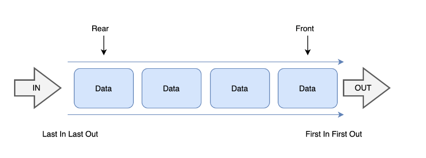

# 큐

- `줄을 서다` '줄' 또는 '대기열'이라는 뜻을 가진 자료구조

- FIFO (First In First Out) 선입 선출



[이미지 링크](https://yoongrammer.tistory.com/46)

- 이때 큐에 삽입하는 연산을 `push`, 꺼내는 연산을 `pop`

```text

일상생활에서 은행 창구에 줄 서 있는 모습

비동기 작업 관리

버퍼링, 서로 다른 쓰레드 또는 프로세스 사이에서 자료를 주고 받을 때

브라우저 이벤트 처리

프린터 대기열

CPU 스케줄링, 디스크 스케줄링

너비 우선 탐색(BFS)

```

## 큐를 구현하는 방식

1. Shift() 메서드 활용

```js
const queue = [];

queue.push(1);

queue.push(2);

queue.push(3);

let firstItem = queue.shift();
```

2. 배열

```js
class Queue {
  constructor() {
    this.items = {};
    this.frontIndex = 0;
    this.backIndex = 0;
  }

  enqueue(item) {
    this.items[this.backIndex] = item;
    this.backIndex++;
    return item;
  }

  dequeue() {
    const item = this.items[this.frontIndex];
    delete this.items[this.frontIndex];
    this.frontIndex++;
    return item;
  }

  peek() {
    return this.items[this.frontIndex];
  }

  get size() {
    return this.backIndex - this.frontIndex;
  }

  isEmpty() {
    return this.size === 0;
  }
}
```

3. 연결 리스트

- 효율적인 메모리 사용

- 일관된 시간 복잡도

- 추가적인 메모리 사용

```js
class Node {
  constructor(value) {
    this.value = value;
    this.next = null;
  }
}

class LinkedListQueue {
  constructor() {
    this.front = null;
    this.rear = null;
    this.size = 0;
  }

  enqueue(value) {
    const newNode = new Node(value);

    if (this.isEmpty()) {
      this.front = newNode;
      this.rear = newNode;
    } else {
      this.rear.next = newNode;
      this.rear = newNode;
    }

    this.size++;

    return this.size;
  }

  dequeue() {
    if (this.isEmpty()) {
      return null;
    }

    const removedNode = this.front;

    this.front = this.front.next;

    this.size--;

    if (this.isEmpty()) {
      this.rear = null;
    }

    return removedNode.value;
  }

  peek() {
    return this.isEmpty() ? null : this.front.value;
  }

  isEmpty() {
    return this.size === 0;
  }

  getSize() {
    return this.size;
  }
}
```

## Queue의 Big-0

1. Enqueue : O(1)

2. Dequeue : O(1) or O(n), O(n)인 경우는 배열을 사용하여 Queue를 구현할 경우 Array.shift()

3. Peek : O(1)

4. isEmpty : O(1)

5. Size (크기 확인)

## reference

- `코딩테스트 합격자 되기, js편`

- https://en.wikipedia.org/wiki/Queue_(abstract_data_type)

- https://medium.com/%EC%95%8C%EA%B3%A0%EB%A6%AC%EC%A6%98%EC%9D%80-%EB%AF%B8%EC%B9%9C%EC%A7%93%EC%9D%B4%EB%8B%A4/6-%EC%9E%90%EB%A3%8C%EA%B5%AC%EC%A1%B0-%ED%81%90-5ed170bcc8d0
