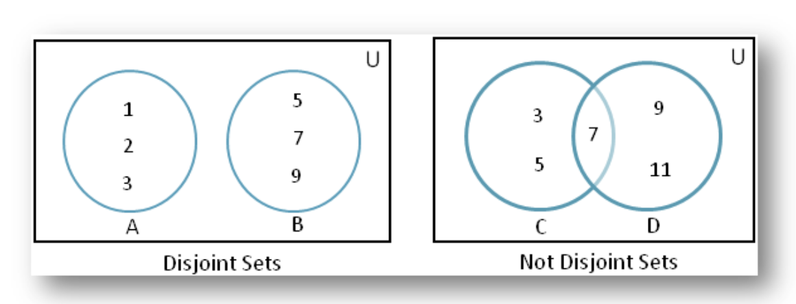

# 집합

- 순서와 중복이 없는 원소들을 갖는 자료구조

## 집합의 종류

- 원소 개수가 유한하면 유한 집합, 무한하면 무한 집합, 아무런 원소가 없으면 공집합 등 다양하다.

## 상호배타적 집합

- 집합 A와 집합 B의 원소 중 겹치는 원소가 없으면 교집합이 없다.

- 사이클을 확인하는 경우

  - 이미지 분할

  - 도로 네트워크 구성

  - 최소 신장 트리 알고리즘

  - 게임 개발

  - 클러스터링 작업

## 집합의 연산

- 배열을 활용한 트리로 구현한다.

  - 대표원소
    - 집합의 원소 중 집하을 대표, 트리로 구현한 집합에서는 루트노드가 대표원소이다.
  - 배열로 집합을 표현하기

    - 배열의 인덱스는 자신, 배열의 값은 부모 노드를 의미함
    - `disjointSet[3]=9`

    

## 유니온-파인드 알고리즘

    - 합치다 => union, 탐색 => find

- 파인드

  - 특정 노드의 루트 노드가 무엇인지 탐색하는 방법

- 현재 노드의 부모 노드를 확인

  - A,B 두 노드가 있는데 루트 노드가 서로 같다면 같은 집합에 속한다.

- 현재 노드의 부모 노드를 확인하고 부모 노드가 루트 노드인 경우 연산을 종료

- 유니온

  - 두 집합을 하나로 합치는 연산, 두 집합을 합친다.
    - 두 집합에서 찾기 연산을 통해 루트 노드를 찾는다.
    - 찾은 두 루트 노드의 값을 비교함
    - 두 집합을 합칩니다. 합치는 방법은 간단하다 두 집합의 루트 노드를 같게하는 것이다.

- 랭크
  - 현재 노드를 기준으로 하였을 때 가장 깊은 노드까지의 경로 길이를 말한다.
