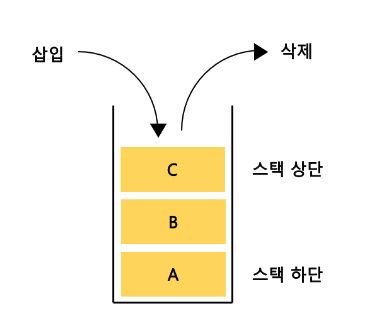

# 스택

- `스택` (쌓는다) 데이터 구조 중에 하나.

- LIFO (Last In First Out) 후입 선출



[이미지 링크](https://bambbang00.tistory.com/3)

- 이때 스택에 삽입하는 연산을 `push`, 꺼내는 연산을 `pop`

```text

브라우저 히스토리 뒤로가기 및 앞으로가기는 스택 구조를 활용.

텍스트 편집기나의 undo, redo

DOM 트리 탐색

```

```js
class Stack {
  constructor() {
    this._arr = [];
  }

  push(item) {
    this._arr.push(item);
  }

  pop(item) {
    return this._arr.pop();
  }

  peek() {
    return this._arr[this._arr.length - 1];
  }
}

const stack = new Stack();

stack.push(1);
stack.push(2);
stack.push(3);

stack.pop(); //3
```

### reference

- `코딩테스트 합격자 되기, js편`
