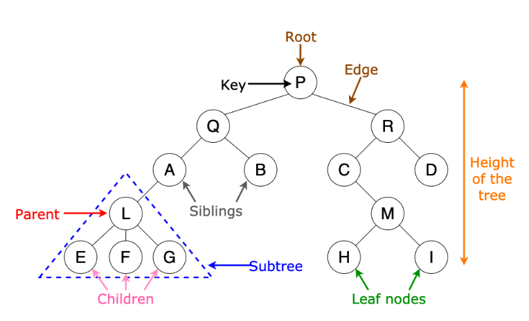

# 트리

- 그래프의 일종, 한 노드에서 시ㄱ해서 다른 저점들을 순회여 자기 자신에게 돌아오는 순환이 없는 연결 그래프

- 단방향 이면서, 하나의 데이터 아래에 여러 개의 데이터가 존재할 수 있는 비선형 구조

- 트리에서 최상위 노드를 루트노드라고 함

- 트리에서 연결된 서로 둘간의 관계는 부모 자식 관계, 만약 자식 노드가 없는 노드는 말단 노드라고 한다.



```text
노드: 트리 구조를 이루는 개별 데이터

루트 : 트리구조의 시작점

부모 : 두 노드가 상하관계일때 상대적으로 루트에서 가까운 노드

자식 : 두 노드가 상하관계일때 상대적으로 루트에서 먼 노드

리프 : 트리구조의 끝 지점, 자식 노드가 없다.

깊이 : 루트 ~ 하위 계층의 특정 노드까지의 깊이

레벨 : 같은 깊이를 가지고 있는 노드를 묶어서 레벨로 표현

높이 : 리프 노드를 기준으로 루트까지의 높이

서브트리 : 큰 트리 내부의 작은 트리
```

```js
class Tree {
  constructor(value) {
    this.value = value;
    this.children = [];
  }

  insertNode(value) {
    const childNode = new Tree(value);
    this.children.push(childNode);
  }

  contains(value) {
    if (this.value === value) {
      return true;
    }

    for (let i = 0; i < this.children.length; i++) {
      const childNode = this.children[i];
      if (childNode.contains(value)) {
        return true;
      }
    }

    return false;
  }
}

const rootNode = new Tree(null);

for (let i = 0; i <= 4; i++) {
  if (rootNode.children[i]) {
    rootNode.children[i].insertNode(i);
  }
  rootNode.insertNode(i);
}

rootNode; // {value: null, children: Array(5)}

rootNode.contains(5); // false

rootNode.contains(1); // true
```

## 트리의 호라용분야

- 인공지능

- 자동완성 기능

- 데이터베이스

## 이진트리

- 모든 노드의 최대 차수가 2를 넘지 않는 트리를 말한다.

## 배열로 이진트리 표현해보기

- 루트 노드를 배열 인덱스 1번 또는 0번에 저장

- 루트노드를 기준으로 왼쪽 자식 노드의 배열 인덱스는 `(부모노드의 배열 인덱스 X 2)` or `(부모노드의 배열 인덱스X2+1)`

- 루트노드를 기준으로 오른쪽 자식 노드의 배열 인덱스는 `(부모노드의 배열 인덱스 X 2 + 1)` or `(부모노드의 배열 인덱스 X 2 + 2)`

- 배열로 트리를 표현하면 자식이 없거나 쓰지 않는 익덱스들도 모두 빈 값이므로 메모리가 낭비될 수 있음.

- 메모리만 넉넉하다면 괜찮다.

- 이진트리의 노드가 N개 일때 배열로 이진트리를 생성하면 O(N)이 걸림

## 이진트리의 순회

- preorder, inorder, postorder

- 현재 노드를 부모기준으로 왼쪽 => 오른쪽, 왼쪽 => 부모 => 오른쪽, 왼쪽 => 오른쪽 => 부모

- preorder 의 경우 거치는 노드를 방문하기 때문이다.

- inorder 의 경우 정렬된 순서대로 값을 가져온다.

## 포인터로 표현

- 포인터로 표현한 트리는 배열과 달리 인덱스 연산을 하지 않기 떄문에, 메모리 공간을 낭비하지 않으나, 구현난이도가 높다.

## 이진 탐색트리의 시간 복잡도

- 균형이 유지되었다고 가정했을때, 탐색 트리에 저장된 노드가 N개 일때 O(logN), 군형이 맞지 않을때는 배열과 비슷하다.

- `코딩테스트 합격자 되기, js편`
- https://ko.wikipedia.org/wiki/%ED%8A%B8%EB%A6%AC_%EA%B5%AC%EC%A1%B0
- https://ko.wikipedia.org/wiki/%EC%9D%B4%EC%A7%84_%ED%83%90%EC%83%89_%ED%8A%B8%EB%A6%AC
